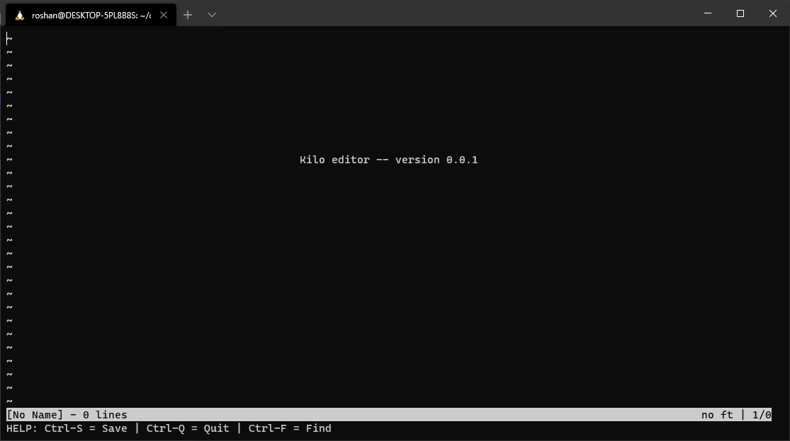

# Kilo

Kilo is a terminal text editor made using C. It is primarily for editing C and C++ files, and it has the features that you would see on any modern-day text-editor. 

### Features
- Syntax Highlighting
    - Keywords
    - Multiline & Single-line Comments
    - Special nonprintable characters
    - C & C++ keywords highlighting
- Find words
    - Highlighting for words you are trying to search for
    - Once words are found, the Kilo automatically places the cursor at the found word
- Warning if you modified a file and did not save
- Automatic resizing for different terminal sizes



## How to Use
```sh
# clone the repo
git clone https://github.com/Roshan-Thomas/kilo-text-editor-c.git

cd kilo-text-editor-c

# Run the makefile for latest update
make

# Run the text-editor
./kilo
```

To view any file in Kilo, run
```
./kilo <filename>
```

## Helpful Commands
```
Ctrl-Q : Quit
Ctrl-S : Save
Ctrl-F : Find
```